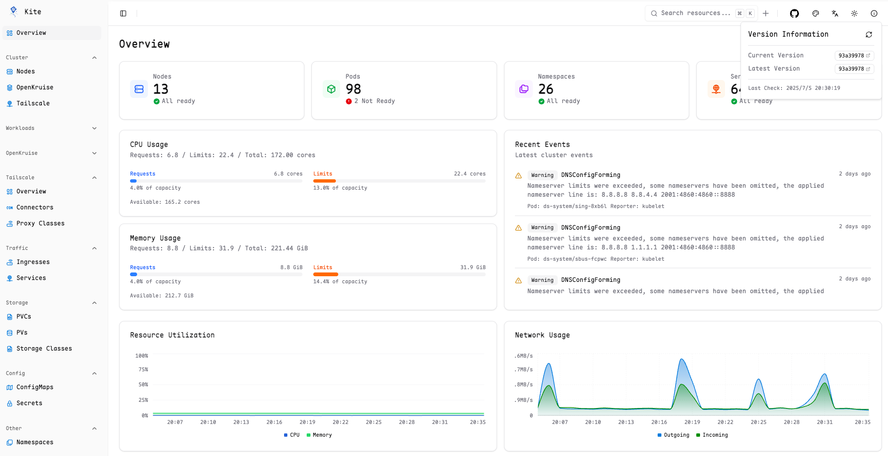
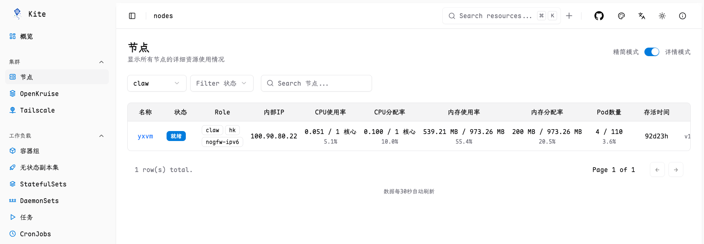
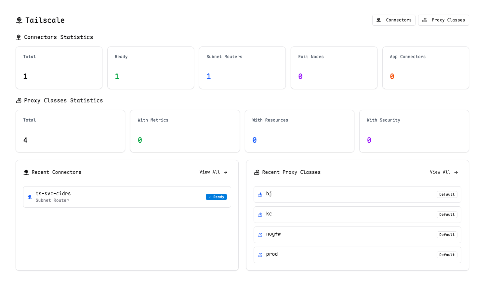
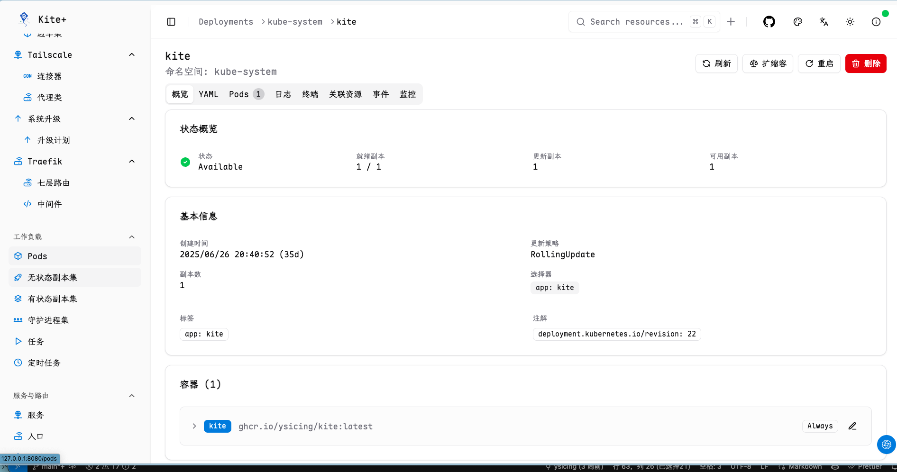

# Kite - 现代化 Kubernetes 仪表板

<div align="center">


_现代化、直观的 Kubernetes 仪表板_

[](https://golang.org)
[](https://reactjs.org)
[](https://www.typescriptlang.org)
[](LICENSE)

</div>

## 📋 关于此 Fork

本项目是基于 [zxh326/kite](https://github.com/zxh326/kite) 的 fork 版本， 个人性定制。

### 🚀 Fork 版本特色

- **🌏 完整中文支持** - 全面的中文界面和文档
- **🔧 个人特色增强** - 针对个人用户的功能优化
- **📊 集成OpenKruise** - 更加强大的工作负载管理和运维支持
- **📈 支持Tailscale** - 可视化管理Tailscale集成
- **🎨 界面优化** - 更好的用户体验和界面设计
- **🛠️ 部署简化** - 简化的部署流程和配置

---

Kite 是一个轻量级、现代化的 Kubernetes 仪表板，提供直观的界面来管理和监控您的 Kubernetes 集群。它提供实时指标、全面的资源管理、多集群支持以及优美的用户体验。

---

## 📸 界面截图

### 🏠 仪表板概览


_全面的集群概览，包含实时指标和资源统计_

<details>

<summary>更多截图</summary>

### 🚀 集群纬度资源


_节点概览_

### 🚀 Tailscale集成


_Tailscale概览视图_

### 🚀 资源管理


_详细的部署视图，包含 Pod 管理和状态监控_

### 📊 实时监控


_实时 CPU、内存和网络使用图表，包含历史数据_

### 🔍 全局搜索


_强大的跨所有 Kubernetes 资源的搜索功能_

### 📋 实时日志


_实时日志流，支持过滤和搜索功能_

### 💻 Web 终端


_通过浏览器界面直接在 Pod 中执行命令_

### 🔐 OAuth 认证


_安全的 GitHub 和自定义 OAuth 提供商认证_

</details>

---

## ✨ 功能特性

### 🎯 **现代化用户体验**

- 🌓 **多主题支持** - 深色/浅色/彩色主题，支持系统偏好检测
- 🔍 **高级搜索** - 跨所有资源的全局搜索
- 🏘️ **多集群管理** - 无缝切换多个 Kubernetes 集群
- 🌏 **多语言支持** - 支持中文和英文界面

### 🏘️ **多集群管理**

- 🔄 **无缝集群切换** - 一键切换多个 Kubernetes 集群
- 📊 **按集群监控** - 每个集群独立的 Prometheus 配置
- ⚙️ **Kubeconfig 集成** - 自动发现 kubeconfig 文件中的集群

### 🔍 **全面的资源管理**

- 📋 **完整资源覆盖** - Pods、Deployments、Services、ConfigMaps、Secrets、PVs、PVCs 等
- 📄 **实时 YAML 编辑** - 内置 Monaco 编辑器，支持语法高亮和验证
- 📊 **详细资源视图** - 深入的信息展示，包含容器、卷、事件和状态
- 🔗 **资源关系** - 可视化相关资源之间的连接（如 Deployment → Pods）
- ⚙️ **资源操作** - 直接从 UI 创建、更新、删除、扩缩容和重启资源
- 🔄 **自定义资源** - 完全支持 CRDs（自定义资源定义）

### 📈 **监控与可观测性**

- 📊 **实时指标** - 基于 Prometheus 的 CPU、内存和网络使用图表
- 🤖 **智能发现** - 自动发现集群中的 Prometheus 服务，无需手动配置
- 🔗 **多种访问方式** - 支持 ClusterIP、NodePort、LoadBalancer、Ingress 等
- 📋 **集群概览** - 全面的集群健康状态和资源统计
- 📝 **实时日志** - 实时流式传输 Pod 日志，支持过滤和搜索
- 💻 **Web 终端** - 通过浏览器直接在 Pod 中执行命令
- ⚡ **零配置部署** - 支持常见 Prometheus 部署模式的自动识别

### 🔐 **身份认证**

- 🛡️ **OAuth 集成** - 支持 GitHub 和自定义 OAuth 提供商
- 🔑 **用户名/密码** - 使用环境变量的简单认证

---

## 🚀 快速开始

### 环境变量

| 变量名                     | 描述                                                                                          | 默认值                        | 必需 |
| -------------------------- | --------------------------------------------------------------------------------------------- | ----------------------------- | ---- |
| `PORT`                     | 服务器端口                                                                                    | `8080`                        | 否   |
| `KUBECONFIG`               | 多集群访问的 Kubernetes 配置路径                                                              | `inCluster or ~/.kube/config` | 否   |
| `ENABLE_ANALYTICS`         | 启用匿名使用分析                                                                              | `false`                       | 否   |
| `PROMETHEUS_URL`           | 默认 Prometheus 服务器 URL，详见 [Prometheus 集成指南](docs/PROMETHEUS_INTEGRATION_GUIDE.md) | `auto-discovery`              | 否   |
| `<CLUSTER>_PROMETHEUS_URL` | 集群特定的 Prometheus URL，优先级高于默认配置                                                 | `auto-discovery`              | 否   |
| `JWT_SECRET`               | 用于签署令牌的 JWT 密钥。默认为随机字符串                                                     | `random string`               | 是\* |
| `OAUTH_ENABLED`            | 启用 OAuth 认证。[OAuth 设置指南](docs/OAUTH_SETUP.md)                                       | `false`                       | 否   |
| `OAUTH_ALLOW_USERS`        | 允许访问仪表板的用户逗号分隔列表，支持通配符（\*）允许所有用户                                | `-`                           | OAuth\* |
| `KITE_USERNAME`            | 基本认证的用户名。如果设置，则启用密码认证                                                    | `-`                           | 否   |
| `KITE_PASSWORD`            | 基本认证的密码。如果设置，则启用密码认证                                                      | `-`                           | 否   |

\*仅在启用 OAuth 时需要

### Docker 部署

使用 Docker 运行 Kite，您可以使用预构建的镜像：

```bash
docker run --rm -p 8080:8080 -v ~/.kube/config:/home/nonroot/.kube/config ghcr.io/ysicing/kite:latest
```

### 在 Kubernetes 中部署

#### 使用 kubectl

1. **应用部署清单**

   ```bash
   kubectl apply -f deploy/install.yaml
   # 或者在线安装
   kubectl apply -f https://raw.githubusercontent.com/ysicing/kite/refs/heads/main/deploy/install.yaml
   ```

2. **通过端口转发访问**

   ```bash
   kubectl port-forward -n kube-system svc/kite 8080:80
   ```

### 从源码构建

#### 📋 先决条件

1. **克隆仓库**

   ```bash
   git clone https://github.com/ysicing/kite.git
   cd kite
   ```

2. **构建项目**

   ```bash
   make deps
   make build
   ```

3. **运行服务器**

   ```bash
   make run
   ```

---

## 📊 Prometheus 监控集成

Kite 提供了企业级的 Prometheus 集成功能，支持智能自动发现和灵活的配置方式。

### 🤖 自动发现功能

**零配置监控** - Kite 能够自动发现集群中的 Prometheus 服务，无需手动配置 URL：

- ✅ **智能识别**：自动识别 Prometheus Server、Prometheus Operator、Kube-Prometheus-Stack 等部署模式
- ✅ **多种访问方式**：支持 ClusterIP、NodePort、LoadBalancer、Ingress 等访问方式
- ✅ **优先级算法**：根据命名空间、服务类型、命名规范等智能选择最佳端点
- ✅ **连通性测试**：自动验证发现的端点是否可访问

### 🔧 配置方式

**方式1：自动发现（推荐）**
```bash
# 无需任何配置，Kite 会自动发现集群中的 Prometheus
kubectl apply -f deploy/install.yaml
```

**方式2：环境变量配置**
```bash
# 全局默认配置
export PROMETHEUS_URL=http://prometheus.monitoring.svc.cluster.local:9090

# 集群特定配置（多集群环境）
export PRODUCTION_PROMETHEUS_URL=https://prometheus-prod.example.com
export STAGING_PROMETHEUS_URL=http://prometheus-staging.monitoring.svc.cluster.local:9090
```

**方式3：Kubernetes ConfigMap**
```yaml
apiVersion: v1
kind: ConfigMap
metadata:
  name: kite-config
data:
  PROMETHEUS_URL: "http://prometheus-server.monitoring.svc.cluster.local:9090"
```

详细的集成指南和故障排除文档：

- ⚙️ **[配置示例](docs/PROMETHEUS_CONFIG_EXAMPLES.md)** - 各种场景的配置方法

---

## 🔧 开发指南

### 本地开发

1. **安装依赖**

   ```bash
   # 安装 Go 依赖
   go mod download
   
   # 安装前端依赖
   cd ui
   pnpm install
   ```

2. **启动开发服务器**

   ```bash
   # 启动后端
   make run
   
   # 启动前端开发服务器（新终端）
   cd ui
   pnpm dev
   ```

### 构建和部署

使用 Taskfile 进行构建：

```bash
# 代码检查和格式化
task lint

# 构建前端
task web

# 构建后端
task backend

# 构建 Docker 镜像
task docker
```

---

## 🔍 故障排除

### 常见问题

**1. Prometheus 指标不可用**

参见 [Prometheus 设置指南](docs/PROMETHEUS_SETUP.md) 了解如何配置 Prometheus 和 kube-state-metrics。

**2. OAuth 认证问题**

参见 [OAuth 设置指南](docs/OAUTH_SETUP.md) 了解 OAuth 配置的故障排除。

**3. 分析问题**

默认情况下，kite 不会收集任何分析数据。

如果您希望帮助改进产品，可以设置环境变量 `ENABLE_ANALYTICS=true`。

kite 将使用 `umami` 收集极少的匿名使用数据。

源代码可在 [Analytics](https://github.com/ysicing/kite/blob/main/pkg/utils/utils.go#L10-L16) 查看

---

## 🤝 贡献指南

我们欢迎所有形式的贡献！请查看我们的贡献指南：

1. Fork 项目
2. 创建功能分支 (`git checkout -b feature/AmazingFeature`)
3. 提交更改 (`git commit -m 'Add some AmazingFeature'`)
4. 推送到分支 (`git push origin feature/AmazingFeature`)
5. 打开 Pull Request

---

## 📄 许可证

本项目采用 Apache 2.0 许可证 - 查看 [LICENSE](LICENSE) 文件了解详情。

---

## 🙏 致谢

- 感谢 [zxh326/kite](https://github.com/zxh326/kite) 原始项目

---

## 📞 联系方式

- 项目链接：[https://github.com/ysicing/kite](https://github.com/ysicing/kite)
- 原始项目：[https://github.com/zxh326/kite](https://github.com/zxh326/kite)
- 问题报告：[https://github.com/ysicing/kite/issues](https://github.com/ysicing/kite/issues)

---

<div align="center">

**⭐ 如果这个项目对您有帮助，请给我们一个 Star！**

</div>
